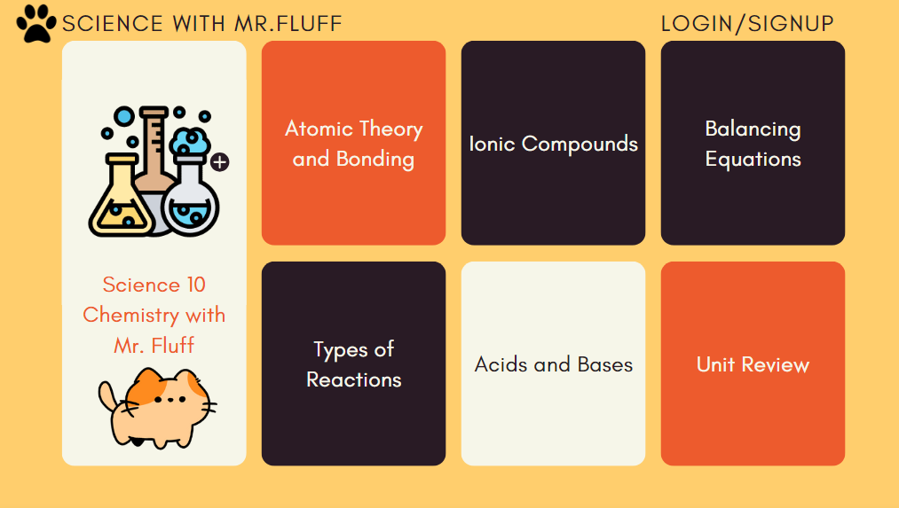
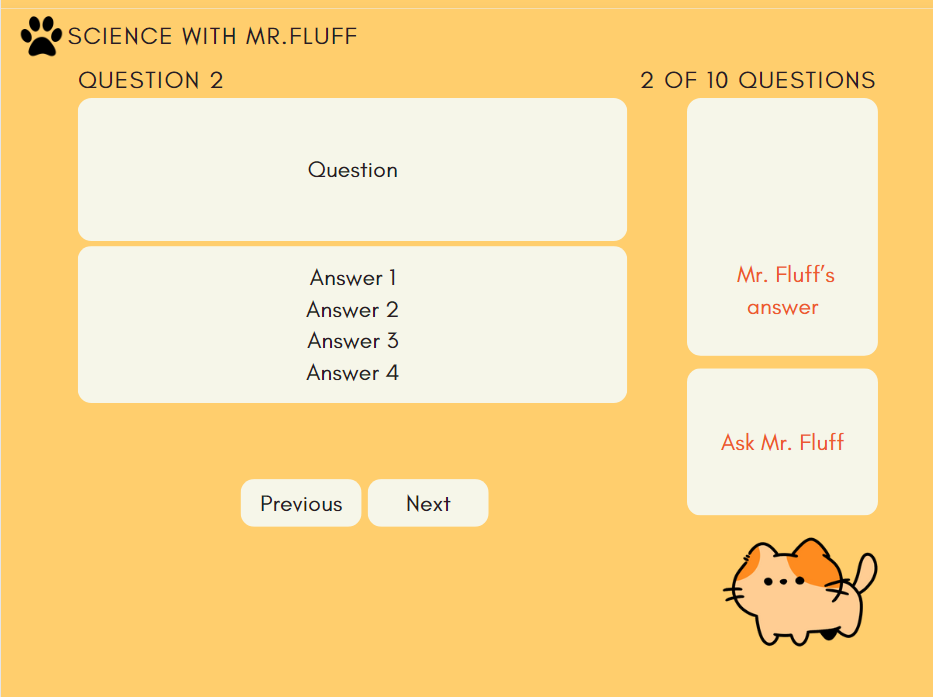
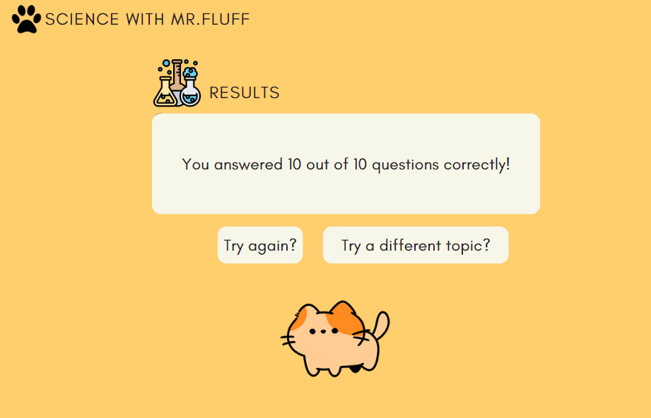

# Project Title

## Overview

My application is a virtual instructor chatbot that can help with questions that students may have, alongside the given assignment.

### Problem

One of the challenges that students can face is the lack of assistance when difficult concepts or questions are encountered outside of regular class hours or during remote learning, without the immediate support of classmates or instructors. This can potentially result in students feeling discouraged and unmotivated to continue learning. With the implementation of a virtual instructor chatbot, students are able to receive help whenever needed.

### User Profile

Users will be high school or university students who have access to mobile phones or computers. They will use the application as a potential assignment or review tool.

### Features

Upon opening the application, the user will be greeted by a welcome page. Clicking on the welcome page brings the user to the first question, along with multiple choice selections.

On the question page, the user will be able to click on an answer and have it display as right or wrong. At any time, an instructor chatbot will also be available to take in questions about the related topic.

When the user is done with a question, clicking on the next button brings the user to the next question.

Upon reaching the last question, a counter is shown with the total number of questions correctly answered.

## Implementation

### Tech Stack

The technologies that will be used include Sass, React, Express, OpenAI Node.js library

### APIs

The application will use OpenAI's API and questions/answers potentially taken from a JSON file.

### Sitemap

- Welcome Page
- Question Pages
- Result Page

### Mockups

Provide visuals of your app's screens. You can use tools like Figma or pictures of hand-drawn sketches.

### Data

The data will be a set of questions and a set of answer choices. It is a one-to-many relationship. Each question has multiple potential answers, but each answer can only have one question.

### Endpoints

The server will implement HTTP GET/POST requests for questions/answers. It will also handle GET requests and possibly parameters of the user's selected question for the instructor chatbot.

### Auth

Login functionality is not necessary

## Roadmap

1. Create and design website structure and layout for the different pages (Welcome Page, Question Pages, Result Page)
   - Define HTML structure with React
   - Use scss for styling
2. Front-end integration with back-end to display a question and answers on a page
   - Setup Express server to take in question data
   - Create API endpoints
   - Implement logic to get and display questions/answers from backend
3. Implement right/wrong answer functionality
   - Design and implement UI components for answer selection
   - Implement logic that can check selected answer against the correct answer
   - Design visuals for correct vs incorrect answers
4. Implement pagination
   - Design UI components for navigating to previous/next question
   - Implement logic that can handle pagination
5. Implement counting number of right answers
   - Create a state that can track the number of correct answers and update the state based on user's responses
   - Display number of correct answers at the end of the assignment
6. Implement OpenAI API to answer questions based on related topic
   - Setup logic to handle instructor chatbot queries
   - Integrate OpenAI API
   - Take in user's questions and display the instructor chatbot's responses

## Nice-to-haves

1. Local storage and authentication functionality so user doesn't lose progress.
2. Animated backgrounds and characters to simulate an "instructor" as the chatbot
3. Question bank for different topics/subject areas and difficulty level
4. Teacher login and functionality so teachers can push their own questions for their classes
